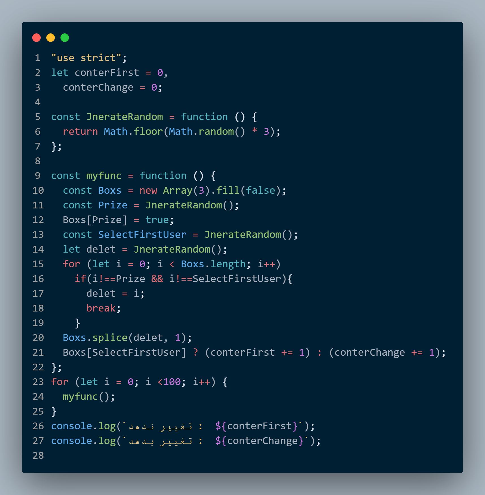

# 📦 Monty Hall Simulation in JavaScript

این پروژه یه شبیه‌سازی ساده و جمع‌وجوره از مسئله‌ی معروف **Monty Hall** به زبان JavaScript ـه، اونم با یه پیچ و تاب خاص 😄

---

### 🤔 چی هست اصلاً این Monty Hall؟

ماجرا از یه برنامه‌ی تلویزیونی شروع شد. شما جلوی ۳ تا در هستید:

- پشت یکی‌شون یه جایزه‌ست (مثلاً ماشین 🚗)
- پشت دو تای دیگه هیچی نیست (💀)

شما یکی از درها رو انتخاب می‌کنید. بعد مجری یکی از درهایی که *جایزه پشتش نیست و انتخاب شما هم نیست* رو باز می‌کنه. حالا یه سوال مهم:

> ❓ آیا بهتره روی در انتخابی‌تون بمونید؟ یا تغییرش بدید؟

---
## 🧠 منطق کد

- `JnerateRandom` یه عدد تصادفی از ۰ تا ۲ برمی‌گردونه.
- یه آرایه‌ی سه‌تایی از `false` ها می‌سازیم و یکی‌شو `true` می‌کنیم (که همون جایزه‌ست).
- کاربر یه در رو تصادفی انتخاب می‌کنه.
- یکی از درهای اشتباه حذف میشه.
- در نهایت بررسی می‌کنیم اگر کاربر **تغییر بده**،  شانس بیشتری دارع یا نه.

---

## 🔁 شبیه‌سازی

کد 100 بار این فرآیند رو تکرار می‌کنه تا ببینیم احتمال برد در هر استراتژی چقدره:



```js
for (let i = 0; i < 100; i++) {
  myfunc();
}

تغییر ندهد :  33
تغییر بدهد :  67

این حاصل تست 100 بار این عملیاته   


تغییر ندهد :  216
تغییر بدهد :  784

اینم حاصل تست 1000 بار این عملیات

```


### 💡 نکته
در نگاه اول ممکنه عجیب به نظر برسه، ولی این مسئله تو دنیای احتمال خیلی معروفه و واقعاً جواب  درستش تغییر دادنه انتخابتونه 

---
---

### ❓ چرا تغییر دادن بهتره؟ | تحلیل منطقی مسئله Monty Hall

### 🎯 هدف:
شما باید یکی از ۳ در را انتخاب کنید؛ پشت یکی جایزه است و پشت دوتای دیگر هیچی نیست.

---

### 🎲 مرحله اول: انتخاب اولیه

شما یکی از ۳ در را انتخاب می‌کنید.

- شانس اینکه **درست انتخاب کرده باشید**: `1/3 = 33.3%`
- شانس اینکه **اشتباه انتخاب کرده باشید**: `2/3 = 66.6%`

---

### 🚪 مرحله دوم: مجری یکی از درهای اشتباه را باز می‌کند

- مجری همیشه یکی از دو در اشتباه را که شما انتخاب نکردید و پشت آن جایزه نیست، باز می‌کند.
- حالا فقط دو در باقی می‌ماند: انتخاب شما و یکی دیگر که مجری آن را باز نکرده است.

---

### 🔁 مرحله سوم: فرصت تغییر انتخاب

حالا شما فرصت دارید انتخابتان را تغییر دهید. تصمیم با شماست:

- اگر **تغییر ندهید**: همان شانس اولیه یعنی `1/3` برای برد دارید.
- اگر **تغییر دهید**: چون احتمال اشتباه بودن انتخاب اولیه‌تان `2/3` بود، حالا این شانس به درِ باقی‌مانده منتقل شده → پس شانس برد شما `2/3` می‌شود!

---

### 💡 نتیجه‌گیری:

| استراتژی          | احتمال برد |
|-------------------|-------------|
| باقی ماندن روی انتخاب اولیه | 33.3%        |
| تغییر انتخاب          | 66.6%        |

✅ بنابراین **تغییر دادن انتخاب در اکثر مواقع منجر به برد می‌شود.**

---

### 🧠 مثال واضح‌تر: نسخه‌ی ۱۰۰ دری

فرض کنید به جای ۳ تا در، ۱۰۰ در داریم:

1. شما یکی رو انتخاب می‌کنید → احتمال درست بودن = `1/100`
2. مجری ۹۸ در اشتباه دیگه رو باز می‌کنه
3. فقط یه در دیگه باقی می‌مونه

احتمال اینکه اون در باقی‌مانده جایزه رو داشته باشه: `99/100`

یعنی با تغییر انتخاب، احتمال برد از ۱٪ می‌رسه به ۹۹٪! 😲

---

### 📌 پس به‌صورت خلاصه:

> چون احتمال اینکه انتخاب اولیه‌ اشتباه باشه بالاست (۲ از ۳)،  
> و مجری همیشه یه در اشتباه رو حذف می‌کنه،  
> با تغییر انتخاب، به احتمال زیاد دارید از اشتباه اولیه‌تون عبور می‌کنید.  
> **تغییر دادن هوشمندانه‌تره!**

---
---
---
امیدوارم خوشتون اومده باشع🌱
> alireza shokri 
